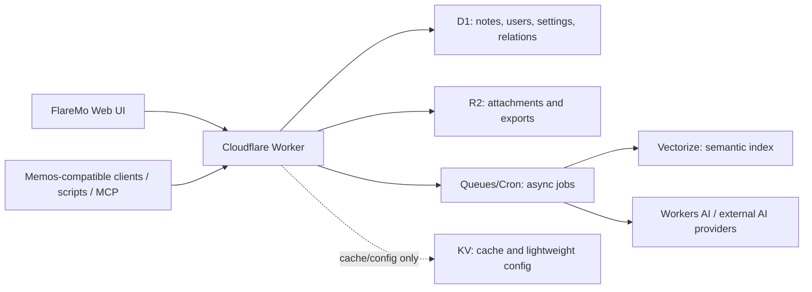

# FlareMo

**Cloudflare 原生 · Memos 兼容 · 个人知识管理平台**

基于 Memos 兼容协议、完整部署在 Cloudflare 上的个人知识管理系统。

[](https://github.com/realchendahuang/FlareMo)
[](https://github.com/realchendahuang/FlareMo)
[](https://github.com/realchendahuang/FlareMo/commits)
[](https://github.com/realchendahuang/FlareMo)
[](https://github.com/realchendahuang/FlareMo/issues)
[](https://github.com/realchendahuang/FlareMo/pulls)
[](https://github.com/realchendahuang/FlareMo/graphs/contributors)
[](./LICENSE)
[](https://github.com/realchendahuang)
[](https://www.cloudflare.com/)
[](https://github.com/usememos/memos)
[](https://github.com/realchendahuang/FlareMo)
[](https://github.com/realchendahuang/FlareMo)

---

## 初心

起因很俗:想找一个"随手记下、慢慢长成知识"的工具。

- 想要 Flomo 那种**开箱即记、不打扰的灵感收集**;
- 想要 Memos 那种**成熟开源生态、数据可迁、API 能玩**;
- 又不想再开一台 VPS、维护 Docker、Postgres、Node 常驻进程。

那怎么办。FlareMo 的做法是把 Memos 的数据模型和 `/api/v1` 当成"规范",运行时**整个重搭到 Cloudflare 上**:Workers 跑 API、D1 存笔记，R2 放附件和导出，Vectorize 与 Workers AI 承载语义检索和 AI 工作流。

**站在 Memos 的肩膀上,做一份长在边缘云上的个人知识库。**

## 定位

FlareMo 不是"再来一个笔记 App"。它的目标是一个完整的、Cloudflare 原生的、Memos 兼容的个人知识管理系统。

它应该同时成立：

- 像 Flomo 一样，打开就能记，不打扰。
- 像 Memos 一样，数据能迁、API 能用、生态能复用。
- 像一个真正的个人知识库一样，支持搜索、标签、附件、分享、导入导出、语义检索、回顾、相关笔记和"问我的笔记"。
- 像一个 Cloudflare-native 产品一样，不依赖 VPS、Docker、Postgres、Node 常驻进程或本地文件系统。

一条硬约束从开仓那天就定死:**全部跑在 Cloudflare 上**。Workers 是"一个请求跑一次"的世界,没有常驻进程、本地文件、原生 SQLite 驱动这些传统后端假设。代价是架构基本要重写,好处是零运维、按量计费,而且天然接得上 Cloudflare 的 AI、向量、队列。

## FlareMo 是什么

围绕三件事设计:

1. **Memos 兼容优先**
   - 沿用 Memos 的领域模型:memos、users、attachments、relations、
     shares、settings、tags,以及从笔记计算出来的 payload/property。
   - 沿用 Memos 的资源命名,如 `memos/{id}`、`users/{id}`、
     `attachments/{id}`。
   - 高价值 `/api/v1` 兼容层,服务于 Memos 客户端、脚本、导入导出、
     OpenAPI、MCP。

2. **Cloudflare 原生运行时**
   - Workers 跑 API 与边缘运行时。
   - D1 存关系型数据。
   - R2 存附件、导出包、生成物、音频。
   - Queues / Cron 处理异步任务。
   - Vectorize + Workers AI 承载语义检索与 AI 工作流。

3. **Flomo 风格的产品体验**
   - 收集为先的写作流。
   - 安静、可快速扫读的时间线。
   - 快速搜索、标签、反链、每日回顾。
   - 轻量个人知识管理,而不是沉重的后台系统。

## 为什么是 Memos + Cloudflare

同类开源项目里,Memos 的生态最成熟:数据模型成型,API 方向明确,有
OpenAPI,导入导出能用,还有一大群真在用的人。

Cloudflare 又恰好有轻量个人知识系统要的原语:全球 Workers、D1 的
无服务 SQLite、R2 对象存储,加上边缘上的 AI 积木。

两者拼起来就是 FlareMo:**Memos 生态兼容 + Cloudflare 原生部署 +
Flomo 风格的收集体验**。

## 与 Memos 的关系

FlareMo 并不打算把原版 Go 写的 Memos 服务原样搬到 Cloudflare。那个
服务依赖传统常驻运行时:`http.Server`、Echo、`database/sql`、
SQLite/Postgres/MySQL 驱动、本地文件服务、SSE 连接管理、后台
runner。

FlareMo 把 Memos 作为**主规范与生态锚点**,然后在 Cloudflare 上重建
运行时:

- 在关键路径上保留兼容的数据形状与公共协议。
- 在 D1 与 R2 上重新实现存储。
- 保留 Memos 兼容的 `/api/v1` 面,以便复用生态。
- 只在前端需要更"边缘友好"的形态时,才加 FlareMo 原生 API。

## 兼容性规划

FlareMo 的兼容目标是让 Memos 生态能真实复用，而不是只做一个导入脚本。

### 数据兼容

- Memos 风格的 memo/user/attachment/relation/share/settings 表。
- 兼容的资源命名。
- 兼容的 memo payload/property 形状,覆盖 tags、title、links、
  tasks、code、location。
- Memos 导入导出路径。

### API 兼容

公共 API 兼容面包括:

- `POST /api/v1/memos`
- `GET /api/v1/memos`
- `GET /api/v1/{name=memos/*}`
- `PATCH /api/v1/{memo.name=memos/*}`
- `DELETE /api/v1/{name=memos/*}`
- `GET /api/v1/{name=memos/*}/attachments`
- `PATCH /api/v1/{name=memos/*}/attachments`
- `GET /api/v1/{name=memos/*}/relations`
- `PATCH /api/v1/{name=memos/*}/relations`
- `POST /api/v1/{parent=memos/*}/shares`
- `GET /api/v1/shares/{share_id}`
- `POST /api/v1/attachments`
- `GET /api/v1/attachments`
- `GET /api/v1/{name=attachments/*}`
- `GET /api/v1/{name=attachments/*}/blob`
- `DELETE /api/v1/{name=attachments/*}`
- `GET /api/v1/export`
- `POST /api/v1/import`
- `GET /openapi.json`
- `POST /api/v1/mcp`

### 生态兼容

- 脚本、工具和 MCP 通过 Cloudflare Access Service Token 访问受保护实例。
- 为 FlareMo 暴露的 `/api/v1` 维护 OpenAPI 文档。
- 基于或对齐该 OpenAPI 生成 MCP 端点。

## 架构



## 本地运行

```bash
pnpm install
pnpm db:generate
pnpm exec wrangler d1 migrations apply flaremo --local
pnpm dev
```

本地应用默认运行在 `http://localhost:8787`，由 Wrangler 同时服务
Workers API 和前端静态资源。

## Cloudflare 部署

FlareMo 使用一个 Worker 承载 API 和前端静态资源，D1 作为主数据库，
R2 作为附件对象存储。

```bash
pnpm exec wrangler d1 create flaremo
pnpm exec wrangler r2 bucket create flaremo-attachments
pnpm exec wrangler d1 migrations apply flaremo --remote
pnpm deploy
```

创建 D1 后需要把真实 `database_id` 写入 `wrangler.jsonc`。线上访问地址
由 Wrangler 部署输出决定。

生产访问控制交给 Cloudflare Access：

- 在 Worker 的 `workers.dev`、Preview URL 或自定义域上启用 Cloudflare Access。
- 面向人的访问使用 Cloudflare Access 的身份登录和 allow policy。
- 面向脚本、工具、Memos-compatible 客户端和 MCP 的访问使用 Cloudflare Access Service Token。
- FlareMo 应用本身不维护实例级访问令牌登录页。

脚本访问示例：

```bash
curl "$FLAREMO_URL/api/v1/memos" \
  -H "CF-Access-Client-Id: $FLAREMO_ACCESS_CLIENT_ID" \
  -H "CF-Access-Client-Secret: $FLAREMO_ACCESS_CLIENT_SECRET"
```

MCP 访问同样走 Cloudflare Access Service Token：

```bash
curl "$FLAREMO_URL/api/v1/mcp" \
  -H "content-type: application/json" \
  -H "CF-Access-Client-Id: $FLAREMO_ACCESS_CLIENT_ID" \
  -H "CF-Access-Client-Secret: $FLAREMO_ACCESS_CLIENT_SECRET" \
  --data '{"jsonrpc":"2.0","id":1,"method":"tools/list"}'
```

这里的 Service Token 是 Cloudflare Access 的服务凭据，不是 FlareMo
应用内的 Bearer token。生产实例应该在 Access policy 中用
`service_token` selector 明确允许该 token。

公开分享路径需要单独配置 Access bypass：

- `/share/*`
- `/api/public/shares/*`

这两个路径允许未登录访问者打开分享内容，但仍由 FlareMo 的 share
token、过期时间和 memo 状态校验控制。其他 API 和前端入口继续放在
Cloudflare Access 之后。

## 建设清单

- [x] Cloudflare Worker + Vite 应用脚手架
- [x] D1 migrations: Memos 兼容核心 schema
- [x] 领域服务层:memos、users、attachments、relations、shares、
      settings
- [x] Memos 兼容的 `/api/v1` memo 端点
- [x] Flomo 风格的收集与时间线 UI
- [x] Memos 数据的导入导出
- [x] R2 附件存储
- [x] Memos 兼容 API 的 OpenAPI
- [x] MCP 端点
- [ ] 基于 Vectorize 的语义搜索
- [ ] AI 回顾、相关笔记、"问我的笔记"工作流

## 参考项目

FlareMo 学习自:

- [usememos/memos](https://github.com/usememos/memos):主要的生态、
  模型与 API 参考。
- [blinkospace/blinko](https://github.com/blinkospace/blinko):AI 检索、
  附件、引用与编辑器交互参考。
- [XuYouo/MeowNocode](https://github.com/XuYouo/MeowNocode):轻量
  Cloudflare D1 笔记应用参考。

## Star 历史

仓库从第一天起就公开造,Star 增长曲线会出现在这里:

[](https://star-history.com/#realchendahuang/FlareMo&Date)

<a href="https://star-history.com/#realchendahuang/FlareMo&Date">
  <picture>
    <source media="(prefers-color-scheme: dark)" srcset="https://api.star-history.com/svg?repos=realchendahuang/FlareMo&type=Date&theme=dark">
    
  </picture>
</a>

## 公开开发

**从开仓第一天起就公开造**。架构决策、踩坑记录、产品目标都摊在仓库
里,欢迎围观、提 issue、提方向。

> 状态:开源启动中。如果你也想要一个能完整跑在 Cloudflare
> 上的 Memos 兼容笔记系统,给个 Star ⭐。

## 贡献

项目还早。目前最有用的贡献:

- Memos API 兼容性研究。
- D1 schema 设计。
- Cloudflare Worker 实现。
- 导入导出兼容性测试。
- Flomo 风格写作流的产品与 UI 方向。

带着具体的兼容目标、API 示例或 Cloudflare 实现思路来开 issue 或
discussion 即可。

## 协议

MIT
