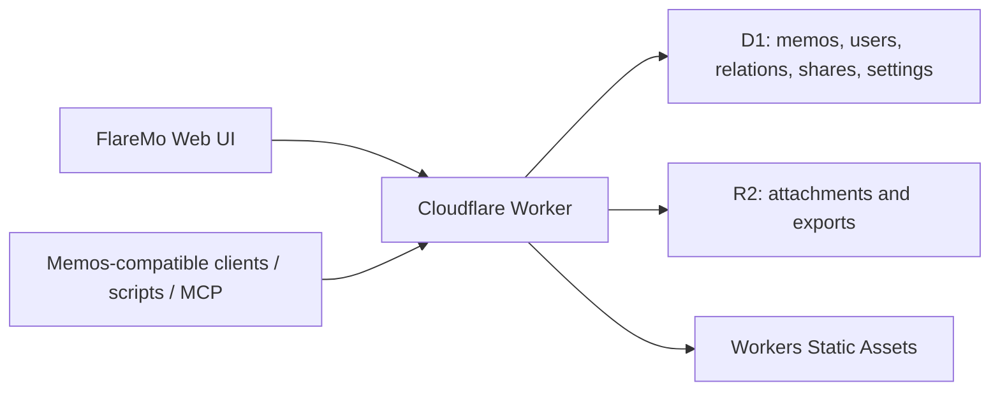

# FlareMo

**Cloudflare 原生的个人笔记系统，提供 Memos 兼容 API。**

[](https://github.com/realchendahuang/FlareMo)
[](./LICENSE)
[](https://www.cloudflare.com/)
[](https://github.com/usememos/memos)

[](https://deploy.workers.cloudflare.com/?url=https://github.com/realchendahuang/FlareMo)

FlareMo 是一个部署在 Cloudflare 上的个人知识管理系统。前端参考 Flomo 的快速记录和安静时间线；对外保留 Memos 风格的资源命名、数据形状和 `/api/v1` 接口；内部实现按 Cloudflare Workers、D1、R2 重新写。

它不需要 VPS、Docker、Postgres、Node 常驻进程，也不在应用里维护一套 Bearer token 登录。人的访问交给 Cloudflare Access，脚本和兼容客户端通过 Cloudflare Access Service Token 进来。

## 现在能做什么

- 快速记录笔记，支持标签和附件。
- 时间线、归档、回收站。
- 搜索、标签筛选、活动热力图。
- R2 附件存储。
- 公开分享链接。
- Memos 数据导入导出。
- Memos 兼容的 `/api/v1` memo / attachment / share 子集。
- OpenAPI 输出。
- MCP 端点。
- 中英文界面。

前端只保留当前已经接上能力的入口。AI 回顾、语义搜索、随机漫步、微信输入这类功能还没实现，就不会挂在界面里占位置。

## 技术栈

- Runtime: Cloudflare Workers
- Web: React, Vite, Tailwind CSS, shadcn/radix primitives
- API: Hono-style Worker routes, Zod contracts, OpenAPI
- Database: Cloudflare D1, Drizzle
- Object storage: Cloudflare R2
- Auth boundary: Cloudflare Access
- Package manager: pnpm

D1 是笔记、用户、标签、分享、关系等业务数据的事实源。R2 只放附件、导出包和对象文件。KV、Vectorize、Workers AI、Queues/Cron 只有在对应功能真的进入实现时才接入，不拿来替代 D1。

## 架构



一个 Worker 同时服务 API 和前端静态资源。D1 保存权威数据，R2 保存附件。Memos 兼容层是 adapter，不是把原版 Memos 服务端搬到 Workers 上跑。

## Memos 兼容面

FlareMo 保留 Memos 风格的核心实体：

- `users/{id}`
- `memos/{id}`
- `attachments/{id}`
- memo payload / property
- relations
- shares
- settings

当前公开 API 子集：

- `POST /api/v1/memos`
- `GET /api/v1/memos`
- `GET /api/v1/{name=memos/*}`
- `PATCH /api/v1/{memo.name=memos/*}`
- `DELETE /api/v1/{name=memos/*}`
- `GET /api/v1/{name=memos/*}/attachments`
- `PATCH /api/v1/{name=memos/*}/attachments`
- `GET /api/v1/{name=memos/*}/relations`
- `PATCH /api/v1/{name=memos/*}/relations`
- `POST /api/v1/{parent=memos/*}/shares`
- `GET /api/v1/shares/{share_id}`
- `POST /api/v1/attachments`
- `GET /api/v1/attachments`
- `GET /api/v1/{name=attachments/*}`
- `GET /api/v1/{name=attachments/*}/blob`
- `DELETE /api/v1/{name=attachments/*}`
- `GET /api/v1/export`
- `POST /api/v1/import`
- `GET /openapi.json`
- `POST /api/v1/mcp`

目标是复用 Memos 的客户端、脚本、导入导出和周边工具。内部服务不复制原版 Memos 的 Go server、多数据库抽象、本地文件假设、后台 runner、SSE、社交功能和实例管理后台。

## 本地运行

```bash
pnpm install
pnpm migrate:local
pnpm dev
```

本地默认地址：

```text
http://localhost:8787
```

`pnpm dev` 会先构建前端，再用 Wrangler 启动 Worker，本地 D1/R2 使用 Wrangler 的本地模拟。

## 部署

一键部署：

```md
[](https://deploy.workers.cloudflare.com/?url=https://github.com/realchendahuang/FlareMo)
```

Cloudflare 会读取 `wrangler.jsonc`，创建 Worker，并为 D1 / R2 资源生成绑定。部署后执行 D1 migrations：

```bash
pnpm migrate:remote
```

手动部署时先创建资源：

```bash
pnpm exec wrangler d1 create flaremo
pnpm exec wrangler r2 bucket create flaremo-attachments
```

把 D1 输出的 `database_id` 写入 `wrangler.jsonc`，再执行：

```bash
pnpm verify
pnpm deploy:dry-run
pnpm migrate:remote
pnpm deploy
```

完整部署说明见 [docs/deploy.md](./docs/deploy.md)。Agent 部署说明见 [docs/agent-deploy.md](./docs/agent-deploy.md)。

## Cloudflare Access

FlareMo 不接受应用内 Bearer token 登录。生产访问边界放在 Cloudflare Access：

- 人使用 Access 登录和 allow policy。
- 脚本、Memos-compatible 客户端和 MCP 使用 Access Service Token。
- 公开分享路径单独配置 Access bypass。

脚本访问示例：

```bash
curl "$FLAREMO_URL/api/v1/memos" \
  -H "CF-Access-Client-Id: $FLAREMO_ACCESS_CLIENT_ID" \
  -H "CF-Access-Client-Secret: $FLAREMO_ACCESS_CLIENT_SECRET"
```

MCP 访问示例：

```bash
curl "$FLAREMO_URL/api/v1/mcp" \
  -H "content-type: application/json" \
  -H "CF-Access-Client-Id: $FLAREMO_ACCESS_CLIENT_ID" \
  -H "CF-Access-Client-Secret: $FLAREMO_ACCESS_CLIENT_SECRET" \
  --data '{"jsonrpc":"2.0","id":1,"method":"tools/list"}'
```

建议 bypass 的公开路径：

- `/share/*`
- `/api/public/shares/*`
- `/assets/*`

分享内容仍由 FlareMo 的 share token、过期时间和 memo 状态校验。

## 项目状态

FlareMo 当前已经具备：

- 可部署的 Cloudflare Worker + Workers Static Assets 一体应用。
- D1 + Drizzle schema 和 migrations。
- R2 附件。
- Memos 兼容 API 子集、导入导出、OpenAPI 和 MCP。
- Flomo 风格的快速记录和时间线 UI。
- Cloudflare Access 生产访问边界。
- Deploy to Cloudflare 按钮。
- Agent 部署 runbook、发版规则、兼容矩阵和开源协作文件。

后续方向见 [ROADMAP.md](./ROADMAP.md)。Memos 兼容范围见 [docs/memos-compatibility.md](./docs/memos-compatibility.md)。

## 工程化

项目不使用 GitHub Actions 作为 CI。发布前由维护者在本地执行：

```bash
pnpm verify
pnpm deploy:dry-run
```

发版规则见 [docs/release.md](./docs/release.md)。维护手册见 [docs/maintenance.md](./docs/maintenance.md)。贡献说明见 [CONTRIBUTING.md](./CONTRIBUTING.md)。安全策略见 [SECURITY.md](./SECURITY.md)。

## 参考项目

- [usememos/memos](https://github.com/usememos/memos)：数据模型、资源命名和兼容 API 参考。
- [blinkospace/blinko](https://github.com/blinkospace/blinko)：搜索、附件和编辑体验参考。
- [XuYouo/MeowNocode](https://github.com/XuYouo/MeowNocode)：Cloudflare D1 轻量应用参考。

## Star

喜欢这个项目，可以点个 Star，方便跟进更新。

[](https://star-history.com/#realchendahuang/FlareMo&Date)

## License

MIT
